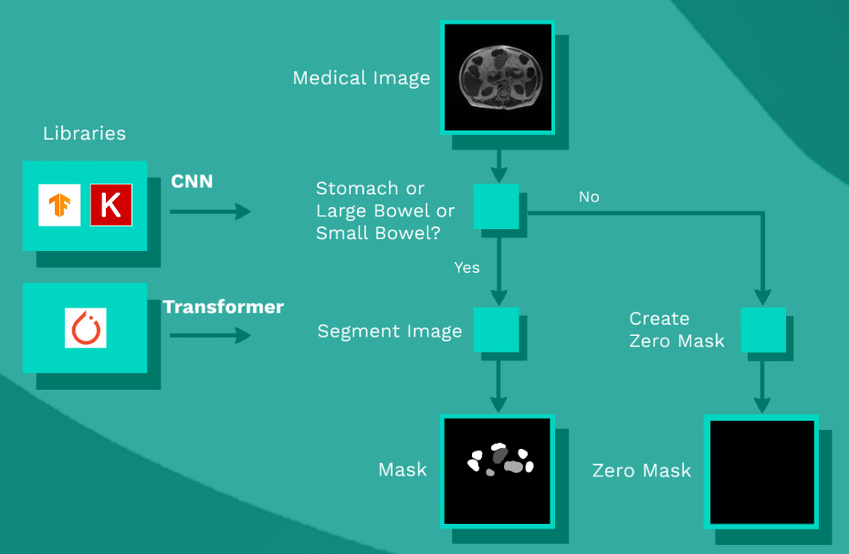

# From 2D Medical Image Segmentation to 3D Model: From AI to VR

## 1.  About Us - DATS DATA team
We are four data science graduates from Spiced Academy, each of us coming from diverse academic backgrounds. This repository showcases our final project, which has been a collaborative effort among [Tina Mangum](https://github.com/tinamangum), [Ali Rahjouei](https://github.com/arahjou), Sergio Sanz ([github](https://github.com/sergio-sanz-rodriguez), [linkedin](https://www.linkedin.com/in/sergio-sanz-rodriguez/)), [Di Walsh](https://github.com/diwalsh). Our aim is to blend innovative technology and teamwork to tackle challenging problems in medical imaging.

## 2. Introduction
In this project, we aim to develop a comprehensive pipeline that uses state-of-the-art machine learning methods, including Convolutional Neural Networks (CNNs) and Transformers, combined with 3D modeling techniques. Our system segments and visualizes CT scan images and is packaged into a user-friendly web-based application. Additionally, we integrate the segmentation results into a virtual reality environment, enhancing the interactive experience for medical professionals. This solution is designed not only to aid in automatic segmentation of medical imagery but also to serve as an innovative educational tool in medical training.

## 3. Workflow
Our approach involved several key steps, starting from data sourcing to deploying a functional VR model:

- **Step 1:** Data Preparation - sourcing and preparing data from the "UW-Madison GI Tract Image Segmentation" Kaggle competition dataset, which includes annotations for three key organs: the stomach, small bowel, and large bowel.
- **Step 2:** Image Classification - training a CNN to classify images based on the presence or absence of the target organs.
- **Step 3:** Image Filtering - selecting relevant images for further processing.
- **Step 4:** Segmentation Model Training - utilizing a Transformer model with transfer learning techniques to segment the CT scans accurately.
- **Step 5:** Web Application Development - assembling the front-end and back-end components for seamless user interaction.
- **Step 6:** 3D Modeling and VR Integration - converting segmented images into 3D models and embedding them in a VR environment to enable immersive visualization.

## 4. Deep Learning Models
### 4.1. Overview
- **Model A (Classification):** This CNN-based model categorizes MRI images into two groups, identifying whether they contain any of the organs of interest. The model is based on an already pre-trained ResNet50V2 architecture.
- **Model B (Segmentation):** After classification, this model segments the images, pinpointing the exact locations of the organs within the scans. The segmentation model utilizes Transformer technology.

<br>  



<br>  

The summary table below shows, for each model, the type of problem it solves, the deep learning technology used, and the libraries employed.

<br>  

| Model   | Type                      | Technology                | Libraries          |
| --------| ------------------------- | --------------------------|--------------------|
| A       | Binary classification     | CNN (RestNet50V2)         | TensorFlow, Keras  |
| B       | Three-class segmentation  | Transformers (SegFormer)  | Pytorch, Lightning |

### 4.2. Notebooks and Python Files

#### 1. [cnn_classification_resnet](notebooks/cnn_classification_resnet.ipynb)
#### 1a. [prepare_data_classification](notebooks/prepare_data_classification.ipynb)
#### 1b. [prepare_data_classification](notebooks/prepare_data_classification.py)
#### 2. [segformer_medical_lightning](notebooks/segformer_medical_lightning.ipynb)
#### 2a. [prepare_data_segmentation](notebooks/prepare_data_segmentation.ipynb)
#### 2b. [prepare_data_segmentation](notebooks/prepare_data_segmentation.py)
#### 3. [model_evaluation](notebooks/model_evaluation.ipynb)
#### 3a. [prepare_data_model_evaluation](notebooks/prepare_data_model_evaluation.ipynb)
#### 3b. [prepare_data_model_evaluation](notebooks/prepare_data_model_evaluation.py)

## 5. Web Application
### 5.1 Overview
Our web application is built using Flask (flask/) and integrates various technologies including JavaScript and Python. It acts as the interface where users can upload CT scans and view both the 2D segmentation results and the 3D visualizations.

## 6. 3D Model and VR Integration
### 6.1 Overview 
The 3D models are created using advanced rendering techniques and are compatible with Meta’s VR platforms. This allows for an interactive exploration of medical imagery in a virtual reality setting, providing a unique educational and diagnostic tool that can be accessed worldwide.

### 6.2 Notebooks

#### [3D_model](notebooks/3D_model.ipynb)

## 7. Trained models

The trained models will be used for the web-based application implemented with flask. For more information, please read the [README file](flask/README.md) in the `flask/` folder.

## 8. Set up your Environment


### **`macOS`** type the following commands : 


- For installing the virtual environment and the required package you can either follow the commands:

    ```BASH
    pyenv local 3.11.3
    python -m venv .venv
    source .venv/bin/activate
    pip install --upgrade pip
    pip install -r requirements.txt
    ```
Or ....
-  use the [Makefile](Makefile) and run `make setup` or install it manually with the following commands:

     ```BASH
    make setup
    ```
    After that active your environment by following commands:
    ```BASH
    source .venv/bin/activate
    ```

### **`WindowsOS`** type the following commands :

- Install the virtual environment and the required packages by following commands.

   For `PowerShell` CLI :

    ```PowerShell
    pyenv local 3.11.3
    python -m venv .venv
    .venv\Scripts\Activate.ps1
    pip install --upgrade pip
    pip install -r requirements.txt
    ```

    For `Git-bash` CLI :
  
    ```BASH
    pyenv local 3.11.3
    python -m venv .venv
    source .venv/Scripts/activate
    pip install --upgrade pip
    pip install -r requirements.txt
    ```

    **`Note:`**
    If you encounter an error when trying to run `pip install --upgrade pip`, try using the following command:
    ```Bash
    python.exe -m pip install --upgrade pip
    ```

## 9. References

[UW-Madison GI Tract Image Segmentation](https://www.kaggle.com/competitions/uw-madison-gi-tract-image-segmentation/)  

[Learn OpenCV](https://learnopencv.com/medical-image-segmentation/)  
